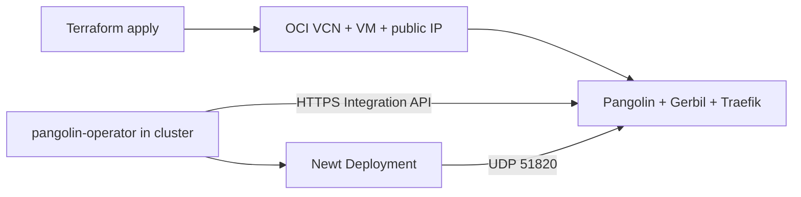

# Pangolin edge (Oracle Cloud)

Terraform creates **all** OCI resources for a [Pangolin](https://pangolin.net) edge node: VCN, subnet, security list, Ubuntu VM, reserved public IP, and (by default) the **Docker Compose** stack over SSH. There is no “bring your own VM” path — only resources this stack creates (or `terraform destroy` removes).

Homelab sites and public resources are managed with **[pangolin-operator](https://github.com/home-operations/pangolin-operator)** in the xd-net cluster (`apps/pangolin-operator.tf`). The edge enables the Pangolin **Integration API** and Traefik route for the operator (`integration_api_url` output).

## What Terraform manages

| Layer | Resources |
|-------|-----------|
| **Network** | VCN, internet gateway, route table, public subnet, security list (22/80/443/51820/21820) |
| **Compute** | Ubuntu instance, reserved public IP |
| **App** | Rendered `config.yml` + `docker-compose.yml` + Traefik + CrowdSec; optional SSH install to `/opt/pangolin` |



## Prerequisites

- OCI account + working **`~/.oci/config`** ([provider guide](https://registry.terraform.io/providers/oracle/oci/latest/docs/guides/getting_started))
- **Compartment OCID** and **region** (`oci_region` must match the region in your config, e.g. `eu-frankfurt-1`)
- **Vercel** DNS zone for `pangolin_base_domain` + API token (same as `apps/` ACME)
- SSH: **auto-generated** by Terraform (or optional `ssh_*_key_path` overrides)

## OCI authentication (`401-NotAuthenticated`)

Terraform uses the same credentials as the OCI CLI. Verify **before** `terraform apply`:

```bash
oci iam region list --output table
# or, with a named profile:
export OCI_CLI_PROFILE=YOUR_PROFILE
oci iam region list --output table
```

If that fails, fix `~/.oci/config` (user OCID, tenancy OCID, fingerprint, `key_file` path) and ensure the API public key is uploaded in OCI Console → Profile → API keys.

Non-default profile in tfvars:

```hcl
oci_config_profile = "YOUR_PROFILE"
```

## Quick start

```bash
cd pangolin-edge
cp config.auto.tfvars.example config.auto.tfvars
# Edit: oci_region, compartment_id, vercel_api_token, domains, letsencrypt_email

terraform init
terraform apply
```

Defaults: `install_pangolin_via_ssh = true` (needs `ssh_private_key_path`), `generate_deploy_bundle = true`.

After apply:

1. **DNS** — by default Terraform creates Vercel A records: `*.yourdomain` and the dashboard host → `public_ip` ([`vercel_dns_record`](https://registry.terraform.io/providers/vercel/vercel/latest/docs/resources/dns_record)). `_out/dns-checklist.txt` is a reference copy. In Vercel, remove any **extra** A records for the same name (e.g. an old homelab IP). Let's Encrypt validates **all** A records; one dead IP blocks the cert and Traefik serves `TRAEFIK DEFAULT CERT`.
2. Open `initial_setup_url` and paste the setup token:  
   `terraform output -raw pangolin_setup_token`
3. Finish dashboard setup and wire up [pangolin-operator](#pangolin-operator) in the cluster.

## Required tfvars

| Variable | Purpose |
|----------|---------|
| `oci_region` | Provider region |
| `compartment_id` | Where VCN/VM live |
| `vercel_api_token` | Vercel DNS (if `manage_vercel_dns`) |
| `ssh_public_key_path` / `ssh_private_key_path` | Optional BYOK; default is generated `_out/ssh/pangolin-edge` |
| `pangolin_base_domain` / `pangolin_dashboard_host` | Pangolin + ACME |
| `letsencrypt_email` | Let's Encrypt + admin |

## Optional tfvars

- `instance_shape` — default **`VM.Standard.A1.Flex`** with **4 OCPU / 24 GB RAM** (uses the full Always Free A1 pool when this is your only A1 VM).
- `boot_volume_size_gbs` — default **50** GB (Always Free block storage pool is 200 GB total). **5 GB is not enough** for OS + Docker images + logs.
- `allow_ssh_cidr` — restrict SSH on the security list (default `0.0.0.0/0`)
- `install_pangolin_via_ssh = false` — only create OCI; deploy later with `./scripts/push-deploy.sh ubuntu@$(terraform output -raw public_ip)`
- Image pins: `pangolin_image_tag`, `gerbil_image_tag`, `traefik_image_tag`
- `enable_integration_api` / `pangolin_integration_api_host` — Integration API for [pangolin-operator](https://github.com/home-operations/pangolin-operator) (default `pangolin-api.<base_domain>`)
- `enable_crowdsec` — CrowdSec + Traefik bouncer on ports 80/443 ([docs](https://docs.pangolin.net/self-host/community-guides/crowdsec)); bouncer API key is created on first install. Enables Traefik `access.log` — install configures `logrotate` ([rotation](https://docs.pangolin.net/self-host/advanced/traefik-log-rotation)).

## pangolin-operator

The edge exposes the [Integration API](https://docs.pangolin.net/self-host/advanced/integration-api) on HTTPS (default `pangolin-api.<base_domain>`). The cluster operator talks to that URL; newt uses the dashboard host.

| Output | Use in `apps/` |
|--------|----------------|
| `integration_api_url` | `pangolin_operator_api_url` (host only, no `/v1`) |
| `pangolin_operator_endpoint` | `pangolin_operator_endpoint` |

**Setup**

1. **Edge** — `terraform apply` with `enable_integration_api = true` (default). On an existing VM, re-deploy config once: `terraform apply` or `./scripts/push-deploy.sh`.
2. **Dashboard** — finish initial setup, create an **organization**, note the **org ID**. **Settings → API keys**: create an Integration API key with scopes for org domains, sites, resources, and targets ([docs](https://docs.pangolin.net/self-host/advanced/integration-api)).
3. **Verify API** — Swagger should return HTTP 200:

```bash
curl -sS -o /dev/null -w '%{http_code}\n' -L "$(terraform output -raw integration_api_url)/v1/docs"
```

Swagger lives at `/v1/docs` (not `/docs`). After changing `config.yml`, restart Pangolin: `docker compose restart pangolin` on the edge VM.
4. **Cluster** — in `apps/config.auto.tfvars`:

```hcl
pangolin_operator_enabled  = true
pangolin_operator_api_url  = "<terraform output integration_api_url>"
pangolin_operator_endpoint = "<terraform output pangolin_operator_endpoint>"
pangolin_operator_org_id   = "<org-id>"
pangolin_operator_api_key  = "<integration-api-key>"
```

Then `cd apps && terraform apply` (installs the operator and `NewtSite` via `apps/newtsite.tf`). Publish routes by annotating HTTPRoutes with `pangolin-operator/site-ref: xd-net` (or your `pangolin_newtsite_name`).

## Destroy

```bash
terraform destroy
```

Removes the VM, VCN, public IP, and related OCI objects created by this stack.

## Not in Terraform (yet)

- Pangolin dashboard: resources, Plex targets (use operator CRs or UI)
- Per-app `PublicResource` / HTTPRoute annotations (after `NewtSite` exists)

## Layout

```
pangolin-edge/
  network.tf / compute.tf   ← OCI infrastructure
  vercel-dns.tf             ← Vercel A records
  ssh.tf                    ← Ed25519 key (or BYOK paths)
  deploy.tf / install.tf    ← Pangolin compose + SSH
  templates/deploy/         ← upstream-aligned config templates
  scripts/push-deploy.sh    ← re-deploy without Terraform SSH
```
