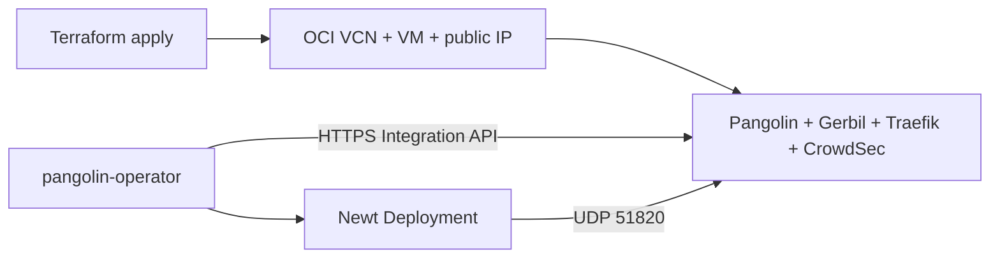

# Pangolin edge (Oracle Cloud)

Terraform for the Pangolin edge VM in **eu-frankfurt-1**: VCN, subnet, security list, Ubuntu A1 instance, reserved public IP, Vercel DNS, and Docker Compose (Pangolin / Gerbil / Traefik / CrowdSec) over SSH into `/opt/pangolin`.

Dashboard: **https://pangolin.ecksd.ee**. Integration API: **https://pangolin-api.ecksd.ee** (used by [pangolin-operator](https://github.com/chaosk/pangolin-operator) in the xd-net cluster). Homelab site **`xd-net`** tunnels via Newt (`apps/pangolin-operator.tf`, `apps/newtsite.tf`).


```mermaid
flowchart LR
  TF[Terraform apply]
  OCI[OCI VCN + VM + public IP]
  PG[Pangolin + Gerbil + Traefik + CrowdSec]
  Op[pangolin-operator]
  Newt[Newt Deployment]

  TF --> OCI --> PG
  Op -->|HTTPS Integration API| PG
  Op --> Newt
  Newt -->|UDP 51820| PG
```

## What Terraform manages

| Layer | Resources |
|-------|-----------|
| **Network** | VCN, internet gateway, route table, public subnet, security list (22/80/443/51820/21820) |
| **Compute** | `VM.Standard.A1.Flex` (4 OCPU / 24 GB), 50 GB boot volume, reserved public IP |
| **DNS** | Vercel A records for `pangolin.ecksd.ee`, wildcard, and `pangolin-api.ecksd.ee` |
| **App** | Rendered `config.yml` + `docker-compose.yml`; SSH install to `/opt/pangolin` |

Secrets and compartment OCID live in gitignored `config.auto.tfvars`. OCI auth is `~/.oci/config` (same as the OCI CLI). SSH keys default to generated `_out/ssh/pangolin-edge`.

## Apply

```bash
cd pangolin-edge
terraform init
terraform apply
```

After apply:

1. Confirm Vercel A records point only at `public_ip` (extra A records break Let's Encrypt; Traefik then serves `TRAEFIK DEFAULT CERT`). `_out/dns-checklist.txt` is a reference copy.
2. Open `initial_setup_url` and paste: `terraform output -raw pangolin_setup_token`.
3. Dashboard org **`xd`**; Integration API key lives in `apps/config.auto.tfvars` (`pangolin_operator_*`).

Re-push compose without recreating OCI: `./scripts/push-deploy.sh ubuntu@$(terraform output -raw public_ip)`.

## Cluster wiring

`apps/` already points at this edge:

| Edge | Cluster |
|------|---------|
| `https://pangolin-api.ecksd.ee` | `pangolin_operator_api_url` |
| `https://pangolin.ecksd.ee` | `pangolin_operator_endpoint` |
| NewtSite **`xd-net`** | `pangolin-operator/site-ref: xd-net` on HTTPRoutes |

Verify Integration API (Swagger is `/v1/docs`):

```bash
curl -sS -o /dev/null -w '%{http_code}\n' -L "$(terraform output -raw integration_api_url)/v1/docs"
```

After editing `config.yml` on the VM: `docker compose restart pangolin`.

## OCI auth check

```bash
oci iam region list --output table
```

If that fails, fix `~/.oci/config` and the uploaded API key before `terraform apply`. Non-default profile: `oci_config_profile` in tfvars.

## Destroy

```bash
terraform destroy
```

Removes the VM, VCN, public IP, and related OCI objects. Dashboard resources and per-app `PublicResource` / HTTPRoute annotations are not Terraform-managed.

## Layout

```
pangolin-edge/
  network.tf / compute.tf   ← OCI infrastructure
  vercel-dns.tf             ← Vercel A records
  ssh.tf                    ← Ed25519 key
  deploy.tf / install.tf    ← Pangolin compose + SSH
  templates/deploy/         ← config templates
  scripts/push-deploy.sh    ← re-deploy without Terraform SSH
```
